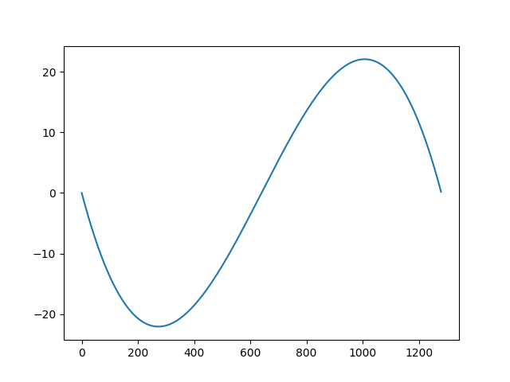
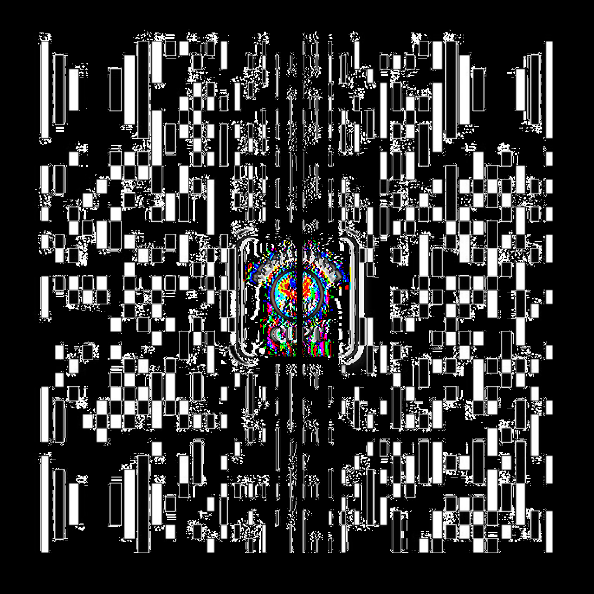

# qrcode_cylinder
change qrcode so that it could paste on clinder surface and recognized by normal app

修正二维码，使得二维码贴到圆柱面上后，可以被正确识别


具体原理：
平面的二维码，贴到圆柱面上后，人眼看到的会有变形，导致可能扫码不成功。
此程序对二维码做一个透视变换，使得二维码贴到圆柱后，人眼看到的二维码和之前平面的二维码是一样的。

需要设置的参数：

```
# 原始二维码的输入图片:需要是xy像素数相等的，rgb三颜色图片
file_name = 'pic/qrcode_for_gh_d6a716faac45_1280.jpg'
#二维码尺寸：单位: mm。是变换后的二维码的尺寸
img_size = 10.0
# 输出二维码图像的像素数（xy像素数相等）
img_out_pixels = 1280  # 像素数
# 要贴到的圆柱形物体的直径。单位: mm
circle_d = 14.0
```

如何使用：

代码非常简单，只需要修改最前面的4个参数，然后运行即可。
结果保存到pic/result.png 文件中。


变换例子：


原始图片：


圆柱变换后图片：


图片像素位移:




图片差异：




